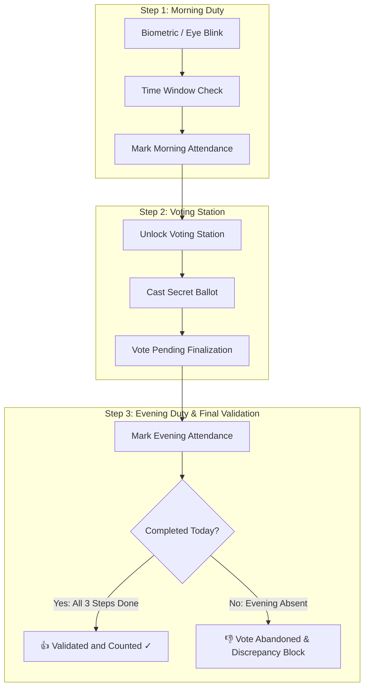

# Weekly Engineering & Development Summary
**Reporting Period:** September 28, 2026 – September 30, 2026  
**Project:** Attendance & Balloting Mobile Application (`AttendanceApp_RevenueCat`) & Cloud Services

---

## Executive Overview
During this week, core architectural, functional, and user-experience milestones were established across the mobile application and associated infrastructure. Work concentrated on enforcing strict duty attendance-voting sequencing, automated discrepancy detection with member blocking, audit reporting for organization administrators, and comprehensive UI neutralization.

---

# Part 1: Date-Wise Conversation Logs

### 📅 Monday, September 28, 2026

#### 1. Amazon Appstore & AWS Cloud Cost Analysis
- **User Query:** Inquiries regarding Amazon Appstore developer account fees, credit card billing thresholds, and potential costs of AWS EC2 snapshots and S3 general-purpose storage buckets.
- **Clarifications Provided:**
  - **Amazon Developer Account:** Registering apps on the Amazon Appstore does not incur per-app submission fees; developer registration is free of recurring charges unless utilizing paid AWS backend services.
  - **Billing Thresholds:** Explanation of negative balance and threshold billing (charges processed when accumulated usage meets the threshold or at the start of the billing cycle).
  - **AWS EC2 Snapshots:** Charged on EBS snapshot storage rates (gigabyte-month based on incremental data changes).
  - **Amazon S3 Buckets:** Storage costs per GB/month, API request tiers (PUT, GET), and data transfer out pricing.
  - **Backup & Portability:** Confirmation of taking local offline backups using AWS CLI/SDK (`aws s3 sync`) to local storage, and ability to re-upload to S3 at any future time.
  - **Nebius Token Factory:** Overview of LLM token processing infrastructure and cost structures.

#### 2. Virtual Amazon Device Simulation for App Testing
- **User Query:** How to configure an Amazon Fire OS virtual device or emulator in Android Studio for testing the Amazon Appstore build.
- **Guidance Delivered:**
  - Standard Android Studio Virtual Device Manager (AVD) system images provide Google APIs / AOSP without native Fire OS ROMs.
  - Recommended installing Amazon Device Specifications (Fire HD 8 / Fire HD 10 hardware profiles) with AOSP system images, or installing the Amazon Appstore APK and Amazon Testing Tool (`App Tester`) on standard emulators for sandbox IAP testing.

---

### 📅 Wednesday, September 30, 2026

#### Session 1: Functionality Update & Initial Requirements Review (13:22 – 13:42)
- **User Request:** Review `f:/attendanceappinstructionschanged.txt` to implement updated duty and voting specifications.
- **Key Realizations:**
  - Attendance and voting must not be independent actions; they form a single daily duty cycle.
  - Previous assumptions had evening duty preceding voting; corrected to enforce: **Morning Attendance ➔ Cast Vote ➔ Evening Attendance**.

#### Session 2: Three-Step Sequence, Discrepancy Detection & Member Blocking (13:42 – 15:08)
- **User Request:** 
  > *"step 3 is wtong first morning then cast vote and then evening attendance and then the record will be entered in local sqlite if morning or evening attendance or cast vote is absent then vote is abandoned and particular period is there in that period only the user can vote and admin in particular authority can add, edit or delete the same. Block the user if discrepency is found there"*
- **Implementation Accomplished:**
  - Implemented the strict 3-step state machine in [`MainActivity.kt`](file:///F:/AttendanceApp_RevenueCat/app/src/main/java/com/lrms/attendanceapp/ui/MainActivity.kt) and [`VotingActivity.kt`](file:///F:/AttendanceApp_RevenueCat/app/src/main/java/com/lrms/attendanceapp/ui/VotingActivity.kt).
  - Designed automated discrepancy monitor: if a member marks morning attendance and casts a vote but fails to mark evening attendance, the vote is categorized as **ABANDONED** and the member account is marked as **BLOCKED**.
  - The discrepancy log is recorded. (`"DISCREPANCY: VOTE ABANDONED and USER BLOCKED"`).
  - Admin authority retains power to add, edit, or delete voting topics, alter shift timings, and manually block/unblock members.

#### Session 3: Shift Window Enforcement & Admin Visibility of Incomplete Votes (15:08 – 15:24)
- **User Request:**
  > *"i am allowed me to mark attendance that is morning attendance and evening attendance to be marked in time period as given by admin of that organisation etc in certain period. if morning attendance is not marked in the same day it will not allow for cast vote and evening attendance for that day. if morning attendance and cast vote is done but evening attendance is not marked on the same day vote is not counted but these entry should display in admin of respective authority"*
- **Implementation Accomplished:**
  - Shift time window validation enforced: Morning attendance can only be marked within `morningShiftStart` to `morningShiftEnd`; Evening within `eveningShiftStart` to `eveningShiftEnd`.
  - Gatekeeper logic: If morning attendance is missing for the day, the voting portal button remains locked (`"Pending Step 1 ⏳"`), and evening attendance cannot be marked.
  - Uncounted vote tracking: Incomplete votes (where evening duty was omitted) are surfaced in the Administrator's Audit section of [`OrganizationDetailActivity.kt`](file:///F:/AttendanceApp_RevenueCat/app/src/main/java/com/lrms/attendanceapp/ui/OrganizationDetailActivity.kt) with full member identifier, timestamps, and ballot selection.

#### Session 4: Visual Status Indicators: Thumbs Up 👍 vs. Thumbs Down 👎 (15:24 – 16:08)
- **User Request:**
  > *"attendance window should be remained open for that period for another day for a member in organistaion, etc. if voting is casted with proper morning and evening and caste button pressed and validated that should appear as thumbs up and if not done then it should be thumbd down in admin"*
- **Implementation Accomplished:**
  - Window continuity: Shift timing windows reset each calendar day, keeping the attendance window operational across days.
  - Indicator logic in [`MemberAdapter.kt`](file:///F:/AttendanceApp_RevenueCat/app/src/main/java/com/lrms/attendanceapp/ui/MemberAdapter.kt):
    - **👍 Thumbs Up:** `👍 VALIDATED and COUNTED ✓` displayed when Morning Attendance + Ballot Cast + Evening Attendance are all completed for the date.
    - **👎 Thumbs Down:** Displayed for any incomplete state:
      - `👎 INCOMPLETE: Morning Shift Missing`
      - `👎 INCOMPLETE: Vote Not Cast`
      - `👎 UNCOUNTED: Evening Shift Absent (<Option>)`
      - `👎 BLOCKED: Discrepancy Found`
  - Respective authority audit dialog added in [`OrganizationDetailActivity.kt`](file:///F:/AttendanceApp_RevenueCat/app/src/main/java/com/lrms/attendanceapp/ui/OrganizationDetailActivity.kt) presenting tallies of total cast ballots, validated votes, and uncounted votes with full CSV export capabilities.

#### Session 5: Member Login Flow Refinement (16:08 – 16:30)
- **User Request:** 
  > *"login screen is where? i am not able to login as individual member as admin or user"*  
  > *"do not build login screen but there is a login button in member in organisation"*
- **Implementation Accomplished:**
  - Clarified and aligned the authentication flow: instead of redirecting through a standalone login credential form, the primary operational path is selecting an organization from [`OrganizationActivity`](file:///F:/AttendanceApp_RevenueCat/app/src/main/java/com/lrms/attendanceapp/ui/OrganizationActivity.kt), opening the organization details, and tapping the direct **"Login"** action on any member item card.
  - Tapping **"Login"** automatically initializes the member's personal duty console ([`MainActivity.kt`](file:///F:/AttendanceApp_RevenueCat/app/src/main/java/com/lrms/attendanceapp/ui/MainActivity.kt)) with that member's credentials, role, shift timings, and active ballots.

#### Session 6: App Simplification, UI Neutralization, and Build Finalization (16:30 – 18:12)
- **User Request:**
  > *"remove switch org it is not required as one member in one organisation cannot switched into another member in another org that case is valid when multiple org is in one single org that login should be there for higher level authority not for admin and user login. Change User Login and Admin Login to Login only. Change & to and only. Remove Instructions in every screen where not required i cannot give command to user in the form of instruction"*
- **Implementation Accomplished:**
  - **Removed "Switch Org":** Eliminated `btn_switch_org` from [`activity_main.xml`](file:///F:/AttendanceApp_RevenueCat/app/src/main/res/layout/activity_main.xml) and [`MainActivity.kt`](file:///F:/AttendanceApp_RevenueCat/app/src/main/java/com/lrms/attendanceapp/ui/MainActivity.kt).
  - **Standardized Button Text:** Changed role-specific labels to **"Login"** across [`item_member.xml`](file:///F:/AttendanceApp_RevenueCat/app/src/main/res/layout/item_member.xml) and [`MemberAdapter.kt`](file:///F:/AttendanceApp_RevenueCat/app/src/main/java/com/lrms/attendanceapp/ui/MemberAdapter.kt).
  - **Converted `&` to `and`:** Cleaned every occurrence across Kotlin entities, layouts, menu titles, seeded database content, and paywall packages.
  - **Neutralized Tone:** Removed commanding and imperative text blocks (e.g., "Mandatory Protocol...", "You must...", "Strictly permitted...", "Please contact..."), replacing them with factual shift hours and status indicators.
  - **Verified Compilation:** Successfully compiled debug APK via Gradle Daemon and copied binary to [`app-debug.apk`](file:///F:/AttendanceApp_RevenueCat/app-debug.apk).

---

# Part 2: Topic-Wise Architecture & Implementation Summary

## 1. Duty Attendance & Voting Sequential Workflow
- **Rules Enforced:**
  1. **Step 1 (Morning Shift):** Member must check in via biometric facial liveness and eye blink verification within the administrator-configured morning shift hours.
  2. **Step 2 (Voting Station):** Casting a ballot is unlocked *only* after Step 1 has been validated for the current date. Once cast, the ballot is stored with `STATUS_PENDING` (awaiting evening validation).
  3. **Step 3 (Evening Shift):** Member must check in via biometric scanner within the evening shift hours. Marking evening attendance triggers the final sealing routine, transitioning the ballot status to `STATUS_CONFIRMED` and `isFinalized = true`.
- **Database Model:** [`VoteRecordEntity.kt`](file:///F:/AttendanceApp_RevenueCat/app/src/main/java/com/lrms/attendanceapp/data/local/VoteRecordEntity.kt), [`AttendanceEntity.kt`](file:///F:/AttendanceApp_RevenueCat/app/src/main/java/com/lrms/attendanceapp/data/local/AttendanceEntity.kt).

---

## 2. Shift Windows & Timing Constraints
- **Configurability:** Each organization defines distinct shift timing windows (`morningShiftStart`, `morningShiftEnd`, `eveningShiftStart`, `eveningShiftEnd`).
- **Dynamic Administrative Updates:** Organization administrators can adjust shift hours directly in [`OrganizationDetailActivity.kt`](file:///F:/AttendanceApp_RevenueCat/app/src/main/java/com/lrms/attendanceapp/ui/OrganizationDetailActivity.kt) or [`MainActivity.kt`](file:///F:/AttendanceApp_RevenueCat/app/src/main/java/com/lrms/attendanceapp/ui/MainActivity.kt) using the "Alter Shifts" dialog.
- **Window Continuity:** Shift windows remain open on subsequent days, resetting tracking for each calendar day.

---

## 3. Discrepancy Detection, Vote Abandonment & Member Blocking
- **Discrepancy Definition:** If a member records morning duty attendance and proceeds to cast a vote, but fails to mark evening duty attendance on that same day, an integrity discrepancy is triggered.
- **Enforcement Actions:**
  1. The cast vote is marked as **ABANDONED** / uncounted.
  2. The member's account status is set to `isBlocked = true`.
  3. A discrepancy audit log is saved on the local device storage.
  4. All future duty and balloting operations are frozen until an Administrator reviews and unblocks the member.
- **Simulation Tooling:** Added an on-device simulation button in [`MainActivity.kt`](file:///F:/AttendanceApp_RevenueCat/app/src/main/java/com/lrms/attendanceapp/ui/MainActivity.kt) (`btn_test_discrepancy_abandon`) allowing instant demonstration of evening absence and subsequent account lockdown.

---

## 4. Authority Audit Portal & Visual Status Indicators
- **Member Directory Cards:**
  - Evaluates daily attendance logs alongside balloting records to display clear, unambiguous badges.
  - **👍 Validated and Counted ✓:** Conferred strictly when Morning Check-in, Vote Cast, and Evening Check-in all exist for today's date.
  - **👎 Incomplete / Uncounted / Blocked:** Conferred whenever any required component is missing or when the user is blocked.
- **Administrator Audit Dashboard:**
  - Displays total cast votes, validated votes, and uncounted votes.
  - Features an uncounted discrepancy banner and a detailed audit dialog listing affected members, timestamps, and selections, with one-tap CSV export.

---

## 5. Member Directory Authentication & Organization Domain Integrity
- **Direct Login Paradigm:**
  - Users select their authority/organization from the directory and click **"Login"** next to their profile card.
  - No redundant multi-screen login hurdles for individual users or admins.
- **Elimination of Cross-Organization Switching:**
  - Removed "Switch Org" from duty consoles.
  - Members cannot jump between different organizations; credentials and duties are strictly bound to their respective authority.

---

## 6. Language Standardization & Tone Neutralization
- **Global Ampersand Replacement:** Replaced every instance of `&` and `&amp;` with `and` in user interfaces, layouts, entity definitions, and seed data.
- **Removal of Commanding Language:** Converted instructional cards, mandatory demands, and imperative warnings into neutral, informative status messages and timing displays.

---

## 7. Cloud, Amazon Appstore & RevenueCat Monetization
- **RevenueCat Integration:** Amazon Store sample API key (`amzn_gBlQlarricNvAfzyHewgmbWKDye`) preserved in [`AttendanceApplication.kt`](file:///F:/AttendanceApp_RevenueCat/app/src/main/java/com/lrms/attendanceapp/AttendanceApplication.kt).
- **Paywall Architecture:** Offers Monthly ($4.99) and Annual ($39.99) Pro subscriptions unlocking cloud sync and report exports, complete with simulated demo purchase mode for offline testing.
- **AWS Infrastructure Insights:** Evaluated S3 bucket object lifecycle, CLI local synchronization, and EC2 snapshot cost economics.

---

## 8. Build & Verification Status
- **Build Target:** Android Debug APK (`assembleDebug`)
- **JDK:** Java 17 (`C:\Program Files\Java\jdk-17`)
- **Result:** `BUILD SUCCESSFUL in 1m`
- **Output Artifact:** [`app-debug.apk`](file:///F:/AttendanceApp_RevenueCat/app-debug.apk) (15,298,417 bytes)

---

## Modified Project Files Reference

| File | Purpose |
|---|---|
| [`MainActivity.kt`](file:///F:/AttendanceApp_RevenueCat/app/src/main/java/com/lrms/attendanceapp/ui/MainActivity.kt) | 3-step sequence state machine, shift window checks, discrepancy block handling |
| [`activity_main.xml`](file:///F:/AttendanceApp_RevenueCat/app/src/main/res/layout/activity_main.xml) | Removed Switch Org, neutralized status texts, updated `&` to `and` |
| [`MemberAdapter.kt`](file:///F:/AttendanceApp_RevenueCat/app/src/main/java/com/lrms/attendanceapp/ui/MemberAdapter.kt) | Standardized button to "Login", implemented 👍 / 👎 status indicators |
| [`item_member.xml`](file:///F:/AttendanceApp_RevenueCat/app/src/main/res/layout/item_member.xml) | Button default text set to "Login", layout styling for thumbs status |
| [`OrganizationDetailActivity.kt`](file:///F:/AttendanceApp_RevenueCat/app/src/main/java/com/lrms/attendanceapp/ui/OrganizationDetailActivity.kt) | Respective authority audit dialog, tally counters, shift alteration |
| [`activity_organization_detail.xml`](file:///F:/AttendanceApp_RevenueCat/app/src/main/res/layout/activity_organization_detail.xml) | Audit card layout, timing displays, topic announcements |
| [`VotingActivity.kt`](file:///F:/AttendanceApp_RevenueCat/app/src/main/java/com/lrms/attendanceapp/ui/VotingActivity.kt) | Pre-condition checks (Morning duty verified before ballot display) |
| [`DatabaseInitializer.kt`](file:///F:/AttendanceApp_RevenueCat/app/src/main/java/com/lrms/attendanceapp/data/local/DatabaseInitializer.kt) | Seed data for 6 organizations & 66 members updated with `and` |
| [`AttendanceEntity.kt`](file:///F:/AttendanceApp_RevenueCat/app/src/main/java/com/lrms/attendanceapp/data/local/AttendanceEntity.kt) | Updated constants to use `and` |
| [`AdminPortalActivity.kt`](file:///F:/AttendanceApp_RevenueCat/app/src/main/java/com/lrms/attendanceapp/ui/AdminPortalActivity.kt) | Occasion filters and master record inspection updated with `and` |
| [`PaywallActivity.kt`](file:///F:/AttendanceApp_RevenueCat/app/src/main/java/com/lrms/attendanceapp/iap/PaywallActivity.kt) | Replaced `&` with `and` across benefits and action buttons |
